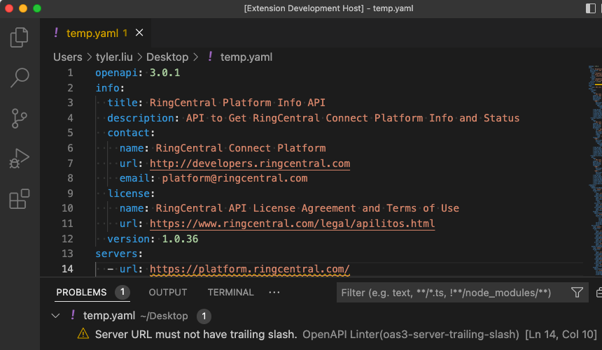
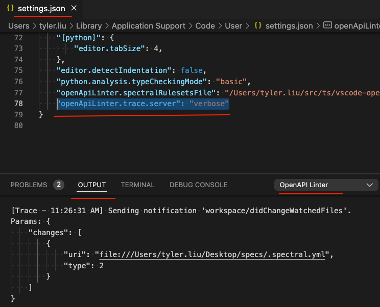

# OpenAPI Linter for VS Code



It will lint YAML files which start with "openapi:". By default, it doesn't lint JSON files. You may change the `openApiLinter.validateFiles` settings to enable JSON support.

It is powered by [Spectral](https://stoplight.io/open-source/spectral/). You can specify a custom ruleset file by adding

```
"openApiLinter.spectralRulesetsFile": "/path/to/.spectral.yml"
```

to `settings.json` of VS Code.

You could also put a `.spectral.yml` file at the root folder of your workspace to override the global settings.

If there is neither local nor global `.spectral.yml` specified. A default `.spectral.yml` file with content `extends: ["spectral:oas", "spectral:asyncapi"]` will be used.


## For maintainers and contributors

### References

- Get started: https://code.visualstudio.com/api/get-started/your-first-extension
- Programming guide: https://code.visualstudio.com/api/language-extensions/language-server-extension-guide
- Sample project: https://github.com/microsoft/vscode-extension-samples/tree/main/lsp-sample
- Publish: https://code.visualstudio.com/api/working-with-extensions/publishing-extension
- Demo project for Spectral: https://github.com/tylerlong/spectral-demo
	- there is an known issue


### Enable trace logging

Add the following to VS Code `setting.json`:

```
"openApiLinter.trace.server": "verbose"
```

Then go open the "OUTPUT" window of VS Code and check channel "OpenAPI Linter":




### Release

```
yarn vsce package
yarn vsce publish
```

### Known issues

- https://github.com/tylerlong/spectral-demo#known-issues
- https://github.com/stoplightio/spectral/pull/2062#issuecomment-1108787968
